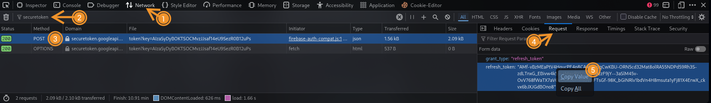

<h1 align="center">HumbleRush</h1>
<p align="center">A powerful tool for <a href="https://rumblerush.io">RumbleRush</a> by PocketHaven.</p>

# 📚 Table of Contents

- 🌟 [Features](#features)
- ⚙️ [Setup](#setup)
- 🔑 [Obtaining Authentication Token](#obtaining-authentication-token)
- ⚠️ [Disclaimer](#disclaimer)

# 🌟 Features

- Boost trophies (10 per request)
- Claim rewards from trophy paths (currency and lootboxes)
  - Lootboxes don't get credited to your account through this requests-based method.
- Automatically upgrade all power-ups

# ⚙️ Setup

```plaintext
git clone https://github.com/NoobToolzz/HumbleRush.git && cd HumbleRush
pip install -r requirements.txt
```
### ⚠️ Important Information

Before you run HumbleRush, you first need to obtain your authentication token.

# 🔑 Obtaining Authentication Token

1. Head to [rumblerush.io](https://rumblerush.io) and press `CTRL + SHIFT + I`, and go to the “Network” tab in the developer tools.
2. In the filter/search bar, enter “login.”
3. Look for the POST request to `login` and click it.
4. Scroll down to “Request Headers” and copy the “Authorization” value.
5. Paste the copied token into `token.txt` and make sure to save it.


### :information_source: Important notice

Please note that the authentication token changes every ~30-45m. If you encounter any "Access Denied" errors, please re-obtain your authentication token.


# ⚠️ Disclaimer

I want to make it clear that I am not responsible for any consequences resulting from your use of HumbleRush to modify or cheat in RumbleRush. By using this tool, you acknowledge that you do so at your own risk and understand the potential consequences.
